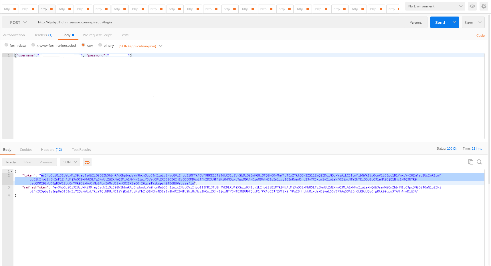
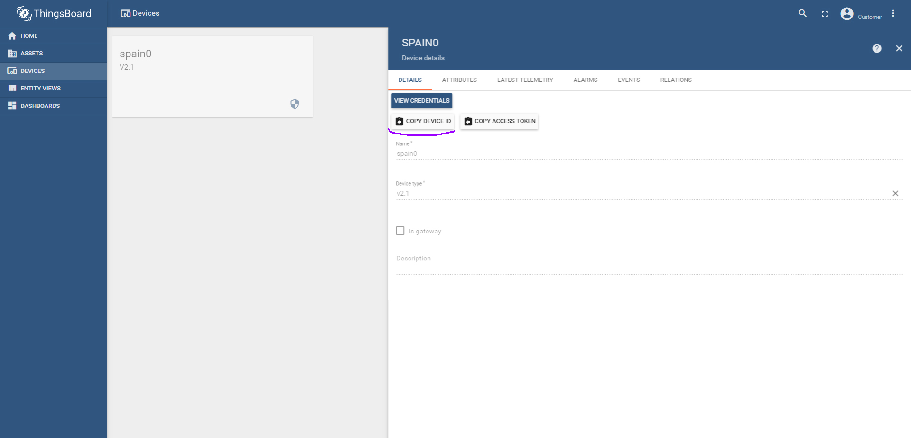
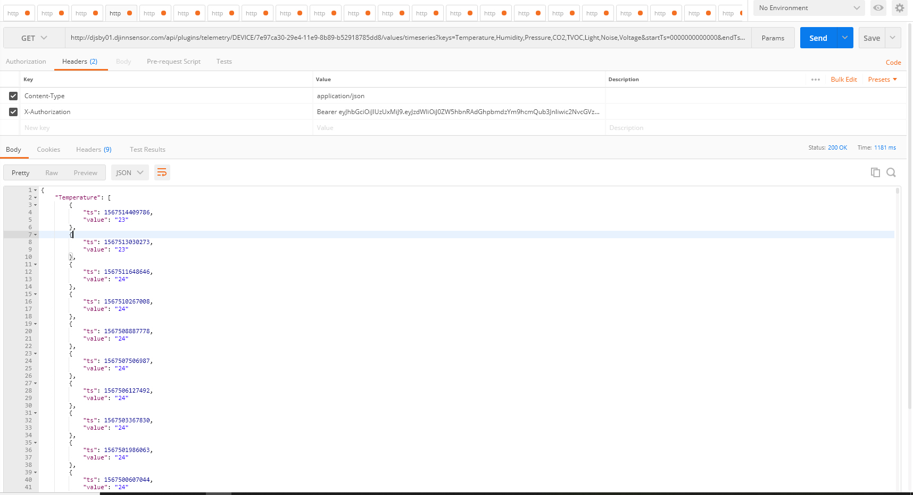

<pre>
To get data from the platform you need to do the following:
<b>1.</b> You need to make a POST request to <b>http://dashboards.djinnsensor.com/api/auth/login</b>
Header: 
  <b>Content-Type: application/json</b>
Body: 
<b>{"username":"{YOUR_USERNAME}", "password":"{YOUR_PASSWORD}"}</b>
  where you need to replace <b>{YOUR_USERNAME}</b> and <b>{YOUR_PASSWORD}</b> with your username and password 
from your personal account at <b>dashboards.djinnsensor.com</b>
example: <b>{"username":"admin@djinnsensor.com", "password":"12345678"}</b>
If you did everything correctly you should get the following answer:

You need to copy this "token" and replace below in "X-Authorization".
<b>2.</b> Now you need to make a GET request to <b>http://dashboards.djinnsensor.com/api/plugins/telemetry/DEVICE/{DEVICEID}/values/timeseries?keys=Temperature,Humidity&startTs=0000000000000&endTs=9999999999999&limit=500</b>
where 
  <b>keys</b> - list the parameters that interest us
  <b>startTs</b> and <b>endTs</b> - time period in timestamp format
  <b>limit</b> - number of measurements
you need to replace {DEVICEID} with your device id in your personal account, screen below:

  
Header: 
  <b>"Content-Type": "application/json"</b>
  <b>"X-Authorization": "Bearer {token}"</b>
  where you need to replace <b>{token}</b> from your previous answer to post request
  result screen:
  
</pre>
